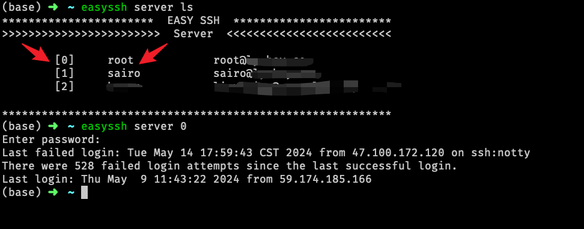

# easyssh


一个命令行工具，对于终端用户来说可以避免安装XShell，tabby等图形化工具

## Feature

+ 自动重连，避免ssh链接长时间不活动被断开
+ 简单，轻量，最小依赖
+ 支持密码和ssh key两种认证方式，自动识别ssh key
+ 支持下标和名称两种方式登录服务器

# 安装
## 二进制
```shell
wget https://github.com/lymboy/easyssh/releases/download/v1.0.0/easyssh_darwin_amd64_v1.0.0 -O /usr/local/bin/easyssh
```

## 源码编译
```shell
$ git clone --depth=1 https://github.com/lymboy/easyssh.git
$ cd easyssh
$ ./build.sh
```

# 配置
```shell
$ mkdir -p ~/.easyssh
$ vim ~/.easyssh/config.yaml
###
server:
  - name: "server1"
    host: "10.100.10.10"
    port: 22 # 可省略，默认22
    user: "foo" # 可省略，默认当前用户
    password: "123456" # 可省略，优先使用ssh key
###
```

# 示例
