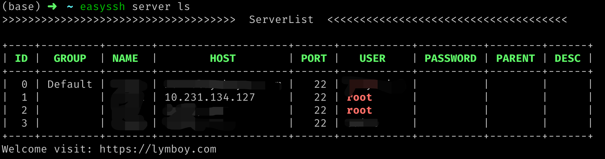

# easyssh
[](https://travis-ci.org/ziutek/easyssh)
[](https://godoc.org/github.com/ziutek/easyssh)
[](https://goreportcard.com/report/github.com/ziutek/easyssh)

一个命令行工具，对于终端用户来说可以避免安装XShell，tabby等图形化工具

## Feature

+ 命令行操作
+ 自动重连，避免ssh链接长时间不活动被断开
+ 安全，轻量，最小依赖
+ 支持密码和ssh key两种认证方式，自动识别ssh key
+ 服务行为可配置

# 安装
## 二进制
```shell
wget https://github.com/lymboy/easyssh/releases/download/v1.0.0/easyssh_darwin_amd64_v1.0.0 -O /usr/local/bin/easyssh
```

## 源码编译
```shell
$ git clone -depth=1 https://github.com/lymboy/easyssh.git
$ cd easyssh
$ ./build.sh
```

# 配置
```shell
$ mkdir -p ~/.easyssh
$ vim ~/.easyssh/config.yaml
###
server:
  - name: "产品库_uat"
    host: "10.100.50.99"
    port: 22 # 可省略，默认22
    user: "" # 可省略，默认当前用户
    password: "" # 可省略，默认使用ssh key
###
```

# 示例
